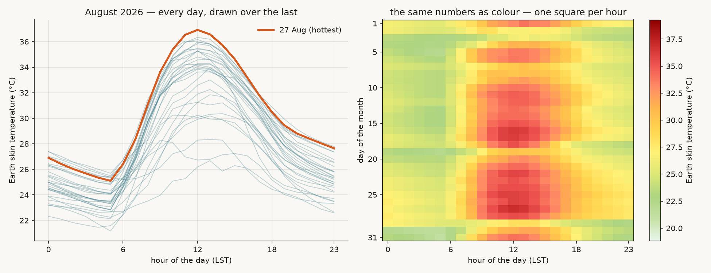
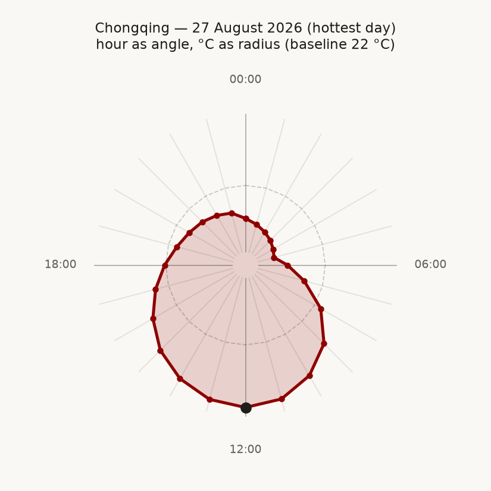
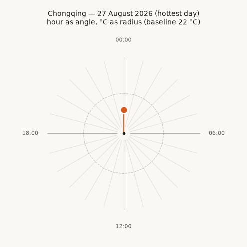
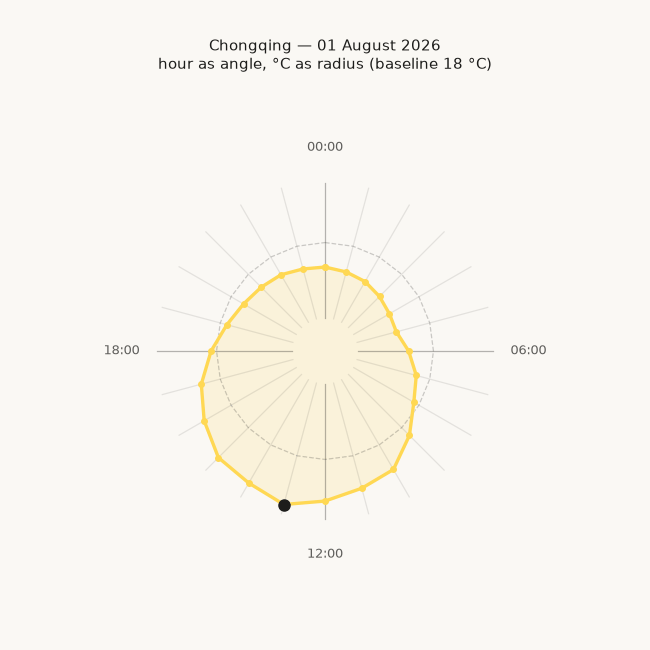

# Earth Skin Temperature over Chongqing, August 2026

## The phenomenon

This dataset records the Earth skin temperature over Chongqing for August 2026 — the temperature of the land surface as retrieved by satellite, not the air temperature a weather forecast would report. **The highest value is 36.92 °C (27 August, 12:00) and the lowest is 21.17 °C (31 August, 05:00)**, with a daily range of 8–12 °C. Temperatures climbed through the first half of the month, held a sustained hot spell from 15 to 27 August, then dropped sharply on 29 August, when the daily peak fell from 36 °C to below 22 °C in three days.

I chose this because Chongqing is my hometown, and every summer feels brutally hot. I expected the land surface to be even more extreme than the air temperature, so I was surprised when the August peak came out at only 36.92 °C. The reason is that air temperature and skin temperature are not the same quantity. Air temperature is measured in the shade about two metres above the ground and is smoothed by the atmosphere; skin temperature is the radiative temperature of the surface itself, and it depends on what that surface is — a dark asphalt road can exceed 60 °C on the same afternoon the air is at 40 °C, while a well-watered field can stay far cooler than the air. The NASA POWER value is a model grid average over a mixed surface, not a thermometer on the hottest pavement, so it sits closer to the air temperature than a real urban surface would. That gap between "what the air feels like" and "what the ground is" is exactly what makes this dataset worth looking at.

## The data

Data from the NASA POWER hourly endpoint:

- Landing page: <https://power.larc.nasa.gov/data-access-viewer/>
- Endpoint: `https://power.larc.nasa.gov/api/temporal/hourly/point?parameters=TS&community=RE&longitude=106.55&latitude=29.56&start=20260801&end=20260831&format=JSON`

One point in Yuzhong district, Chongqing (29.56 °N, 106.55 °E, 357 m), sampled for the whole of August 2026. The file `data/ts-chongqing-2026-08.csv` contains **744 rows** (31 days × 24 hours) and five columns:

| Column | Meaning |
|---|---|
| `time` | Timestamp, `YYYY-MM-DD HH:MM`, in LST (local solar time) |
| `point_id` | Point identifier |
| `lng` / `lat` | Longitude / latitude, in degrees |
| `ts` | Earth skin temperature, in **°C** |

## The figures I kept

### The month at a glance

On the left, every day of August is drawn on top of the last as a 24-hour curve. On the right, the same 744 numbers form a 31 × 24 grid of colour. The left panel shows the shape of each day's cycle — coldest around 05:00 just before sunrise, warmest around 13:00–14:00. The right panel shows the rhythm of the month — deep red in the middle, an abrupt shift to green at the end, and two visible cooling events on 19 and 29 August. What it hides is all the spatial detail: Chongqing covers more than 80,000 km², and one point does not stand for the whole city.

### The hottest day as a clock

The hottest day (27 August) is bent into a circle: the hour becomes an angle, the temperature becomes a radius. The still frame shows the completed shape — an off-centre pear, bulging in the afternoon and narrowing before dawn, with a black dot at 12:00. The animation starts at midnight, and an orange hand pulls a moving dot clockwise, drawing the shape out hour by hour. What it hides is every comparison between days: it tells the story of one day and throws away the thirty other days that were equally real but cooler.

## The drafts I rejected

### Rejected draft 1: a month at a glance with harsh colours

.png>)

Same data, same layout as the month-at-a-glance figure above — the only difference is **the colour band**. The earlier version jumped straight from dark green to red; linear interpolation between two such distant hues passes through a muddy brown, so the colours look dirty mid-transition. The band was later rebuilt as an eleven-stop sequence from light green through yellow and orange to red and dark red. Colour is not decoration — it decides whether the reader can keep their attention on the data.

### Rejected draft 2: a day-by-day clock animation

This played all 31 days of August as an animation, one day per frame. In theory it shows both the daily cycle and the month-long drift; in practice the playback is poor — at a quarter of a second per frame, the changes are neither fast enough to feel like a rhythm nor slow enough to read a shape. The GIF also grows quickly with frame count, so the resolution had to drop. It was replaced with a long, slow animation of a single day.

## Conclusion

One set of 744 numbers, five different pictures: a flat grid, overlaid curves, a single-day polar plot, a multi-day polar overlay, and a day-by-day animation. Each keeps some information and discards the rest. Which parts to keep depends on what you want the reader to see, not on which picture is more advanced.

## References

NASA Langley Research Center. (2024). *POWER Data Access Viewer* [Data set]. NASA Prediction of Worldwide Energy Resources. https://power.larc.nasa.gov/data-access-viewer/

NASA Earth Observatory. (2024). *Land Surface Temperature* [Global map]. https://earthobservatory.nasa.gov/global-maps/MOD_LSTD_M